# ARCHITECTURE.md

## System overview

Full House (desktop/Python version) is a single-process, local-only polling loop.
There is no server, no database, no network I/O, and no multi-process/thread
architecture — everything runs synchronously inside Tkinter's event loop via
`root.after()` callbacks, on one machine, reading only from the screen and writing
only to an on-screen overlay window (plus local files: `table_layout.json` and
`templates/*.png`).

```mermaid
flowchart TD
    subgraph Setup["One-time setup (manual, interactive)"]
        CAL[calibrate.py<br/>click-drag region picker] -->|writes| LAYOUT[(table_layout.json)]
        BT[build_templates.py<br/>captures 52 card crops] -->|writes| TPL[(templates/*.png)]
    end

    subgraph Loop["main.py polling loop (root.after callbacks)"]
        direction TB
        TICK[tick&#40;&#41;] --> TRIGGER{_is_hero_turn?<br/>std&#40;action_trigger crop&#41; > 15.0}
        TRIGGER -- no --> IDLE[overlay.show_idle]
        IDLE -->|IDLE_POLL_INTERVAL_S| TICK
        TRIGGER -- yes --> READ[_read_state]
        READ --> COMPLETE{hero_cards<br/>complete?}
        COMPLETE -- no --> IDLE2[overlay.show_idle<br/>couldn't read hole cards]
        IDLE2 -->|ACTIVE_POLL_INTERVAL_S| TICK
        COMPLETE -- yes --> DECIDE[engine.decide]
        DECIDE --> SHOW[overlay.show]
        SHOW --> PRINT[print tick latency line]
        PRINT -->|ACTIVE_POLL_INTERVAL_S| TICK
    end

    CAPTURE[capture.py<br/>TableCapture.grab] -.reads regions from.-> LAYOUT
    READ -->|cap.grab per region| CAPTURE
    READ -->|hero/board crops| RC[recognize_cards.py<br/>cv2.matchTemplate]
    RC -.matches against.-> TPL
    READ -->|number crops| RT[recognize_text.py<br/>pytesseract OCR]
    READ --> STATE[state.py<br/>TableState dataclass]
    DECIDE --> ENGINE[engine.py<br/>Monte Carlo equity via eval7<br/>+ pot-odds heuristic]
    SHOW --> OVERLAY[overlay.py<br/>Tkinter always-on-top panel]
```

## Module responsibilities

| Module | Responsibility | File path |
|---|---|---|
| `capture.py` | Grab only the calibrated screen regions (not the full screen) via `mss`; convert BGRA → RGB numpy arrays; load `table_layout.json`. | `/Users/gariyuu/Projects/full-house/capture.py` |
| `calibrate.py` | One-time interactive Tkinter tool: screenshot the primary monitor, let the user click-drag a box per named region (hole cards, board cards, stack/pot/bet-to-call, action trigger, N opponent stacks), save to `table_layout.json`. | `/Users/gariyuu/Projects/full-house/calibrate.py` |
| `build_templates.py` | One-time interactive tool: repeatedly captures the `hero_card_1` region while the user shows each of the 52 cards, saving labeled PNG crops to `templates/`. Idempotent — skips cards already captured. | `/Users/gariyuu/Projects/full-house/build_templates.py` |
| `recognize_cards.py` | Loads the 52-card template set (cached module-level singleton) and matches a live region crop against it via `cv2.matchTemplate`, returning a card code (e.g. `"Ah"`) or `None` below `CARD_MATCH_THRESHOLD`. | `/Users/gariyuu/Projects/full-house/recognize_cards.py` |
| `recognize_text.py` | Restricted-vocabulary OCR (`pytesseract`, digits/`.`/`,`/`$`/`K`/`M` whitelist) for stack/pot/bet-to-call numbers; upscales + Otsu-thresholds the crop first; parses "$1,250" / "1.2K" style strings into a `float`. | `/Users/gariyuu/Projects/full-house/recognize_text.py` |
| `state.py` | `TableState` dataclass: hero cards, board, stacks, pot, bet-to-call, opponent stacks. Derives `street` (preflop/flop/turn/river) from board length and `num_opponents` from how many opponent-stack regions currently OCR a value. | `/Users/gariyuu/Projects/full-house/state.py` |
| `engine.py` | Monte Carlo equity calculation (`eval7`, deck minus known cards, simulates `trials` runouts) + pot-odds comparison + a fixed sizing table → a `Decision` dataclass (`action`, `raise_to`, `equity`, `pot_odds`, `reason`). | `/Users/gariyuu/Projects/full-house/engine.py` |
| `overlay.py` | Always-on-top, borderless (`overrideredirect`) Tkinter window pinned to the bottom-right of the screen; renders a `Decision` (color-coded action, detail line, reason line) or an idle state. | `/Users/gariyuu/Projects/full-house/overlay.py` |
| `main.py` | Orchestrator: loads layout, constructs `TableCapture` + `Overlay`, drives the `tick()` poll loop via `overlay.after(...)` (piggybacking on Tkinter's event loop rather than a separate timer/thread), prints per-tick latency. | `/Users/gariyuu/Projects/full-house/main.py` |
| `config.py` | Central, non-secret configuration: paths, poll intervals, `MONTE_CARLO_TRIALS`, OCR whitelist string, `CARD_MATCH_THRESHOLD`, overlay geometry. | `/Users/gariyuu/Projects/full-house/config.py` |

## Data flow

1. **Setup (offline, once per table theme/zoom/window-size):** `calibrate.py`
   produces `table_layout.json` (a dict of named pixel regions:
   `{"left","top","width","height"}` per key). `build_templates.py` produces
   `templates/{rank}{suit}.png` for as many of the 52 cards as the user has shown.
2. **Runtime, per tick (`main.py`):**
   - `capture.TableCapture.grab("action_trigger")` → a numpy RGB crop.
   - `_is_hero_turn`: `np.std(crop) > 15.0` — a cheap brightness/variance proxy for
     "the action buttons are visible," checked on the slow idle interval to avoid
     burning CPU.
   - If active: `_read_state` grabs `hero_card_1`/`hero_card_2`, up to 5 board
     cards, `hero_stack`/`pot`/`bet_to_call`, and every `opponent_stack_*` key
     present in the loaded layout, running each through `recognize_cards` or
     `recognize_text` as appropriate, and assembles a `TableState`.
   - If `state.is_complete_for_decision()` (both hero cards recognized):
     `engine.decide(...)` runs a Monte Carlo simulation and returns a `Decision`.
   - `overlay.show(decision)` updates the three Tkinter labels; `main.py` prints a
     `[tick] Nms ...` line to the terminal.
   - The loop reschedules itself via `overlay.after(ms, tick)` — this makes the
     polling loop and the Tkinter GUI event loop the same loop; there is no
     separate background thread.
3. **No data is persisted per-hand.** `TableState` is rebuilt from scratch every
   tick; nothing is written to disk during normal operation (only the two one-time
   setup scripts write files: `table_layout.json` and `templates/*.png`).

## Error handling

- `capture.load_layout()` raises a plain `RuntimeError` with an actionable message
  ("No table_layout.json found — run calibrate.py first.") if calibration hasn't
  been run — the only guard against running `main.py` before setup.
- `recognize_cards.get_templates()` raises `RuntimeError` if the templates
  directory is empty when a recognition is attempted — same pattern.
- `recognize_cards.recognize_card` and `recognize_text.read_number` both return
  `None` (not an exception) for "nothing recognized" — a deliberate soft-failure
  design, since a card region can legitimately be empty (opponent's hidden card,
  a not-yet-dealt board card) or an amount region can legitimately show nothing
  parseable (bet-to-call is 0/blank). `main.py`'s `_read_state` filters `None`s
  out of `hero_cards` and only appends non-`None` board cards; `is_complete_for_decision`
  then gates the rest of the pipeline on both hero cards being present.
- No `try/except` blocks exist anywhere in the pipeline modules (verified by
  grep) — errors from `mss`, `cv2`, or `pytesseract` (e.g. a bad region, a corrupt
  image) will propagate uncaught and crash `main.py`. There is no retry logic and
  no graceful-degradation path beyond the two `RuntimeError`s above.
- No logging framework — the only runtime visibility is the per-tick `print()` in
  `main.py`, plus whatever `calibrate.py`/`build_templates.py` print during setup.

## Major architectural risks

- **Screen-scraping fragility (inherent, called out in the README itself):** the
  entire pipeline depends on fixed pixel regions captured once during
  `calibrate.py`. Any change to the target site's window size, browser zoom level,
  or visual theme invalidates the layout and requires full recalibration. This is
  not a bug to fix — it's the fundamental tradeoff of screen-scraping vs. an API
  integration (see DECISIONS.md).
- **Template drift:** `recognize_cards.py`'s 52-card template set
  (`build_templates.py`'s output) is tied to one specific visual theme. If the
  target site changes its card graphics (a redesign, a different table skin), all
  52 templates need to be recaptured. There is no versioning or staleness
  detection for templates — a stale template set fails silently as low-confidence
  matches (returns `None`) rather than raising an error.
- **`_is_hero_turn` heuristic is theme-dependent by design** (`main.py`'s own
  docstring flags this): a flat pixel-stddev threshold (`15.0`) on the
  `action_trigger` region. A table theme with a naturally "busy" idle state in
  that region, or a very subtle active state, could produce false positives/negatives.
  The docstring explicitly suggests swapping to a template match as the fix if
  this misfires — that has not been done.
- **`num_opponents` inference is explicitly flagged as noisy** (`state.py`,
  README) — it's derived from how many opponent-stack regions currently OCR a
  value, not from any authoritative seat/player count. This directly affects
  `engine.py`'s Monte Carlo equity calculation (more/fewer simulated opponents
  changes the equity result materially).
- **No error recovery / no retries:** any transient OCR or capture failure (e.g. a
  UI animation mid-frame) is either silently absorbed as a `None` result (fine) or
  an uncaught exception that kills the whole loop (not fine, no supervision/restart
  logic exists in `main.py`).
- **Latency budget is tight and empirically tuned, not algorithmically guaranteed:**
  `config.py`'s comment above `MONTE_CARLO_TRIALS` cites benchmarked numbers
  (~35ms/4k trials, ~160ms/20k trials on unspecified hardware) against a roughly
  1-second target that includes capture + OCR + equity + render. This is
  hardware-dependent and not re-validated by any test in this repo.
